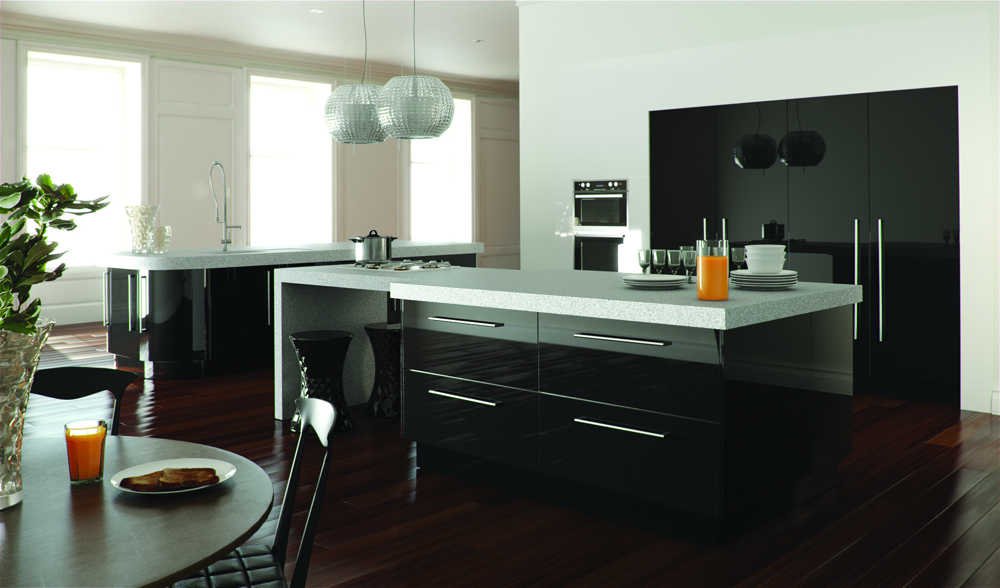

<!DOCTYPE html>
<html lang="en">
<head>
	<meta charset="utf-8">
	<title>DeShaneResumeSite-AboutMe.html</title>
	<link rel="stylesheet" href='https://fonts.googleapis.com/css?family=Aboreto'/>
	<link rel="stylesheet" href='https://fonts.googleapis.com/css?family=Allura'/>
	<link rel="stylesheet" href='https://fonts.googleapis.com/css?family=Carattere'/>
	<link rel="stylesheet" href="https://cdnjs.cloudflare.com/ajax/libs/font-awesome/4.7.0/css/font-awesome.min.css"/>
	<link href="2022.css" type="text/css" rel="stylesheet"/>
</head>

<header>
  <h1>DeShane` Sims Software Developer</h1>
     <nav class=center>
    <ul>
        <li><a href="intro.html">Black Vineyard</a></li>
      <li><a href="desirehome.html">Desire Interior Designs</a></li>
      <li><a href="bakerybase.html">Dessert Bakery</a></li>
      <!--<li><a href=".html">Vineyard</a></li>!-->
	</ul>
  </nav>

    <nav class="socials">
    <ul>
      <li></li>
	  <li></li>
	  <li></li>
	  <li></li>
	</ul>
  </nav>
  
email: deshane.sims@outlook.com 
    References Furbished Upon Request
  

</header>

<body>
  

  

  <h2>Hello
  Welcome</h2>
I am a full-stack software 
	engineer skilled in Python, 
	Unix/Linux, C++, HTML, CSS, JS, MongoDB, and the agile 
	development method. 
	Adapt at handling confidential/sensitive information. 
	Adaptable to advance knowledge and skills in software 
	engineering. This site is to show my skills and store 
	my portfolio. Thank you for your consideration.
 
	
	<!-- 
<h2>Projects</h2>
 -->
<!-- 

    
Black Vineyard

	
Desire Interior Designs

	
Dessert Bakery

	
Coming Soon

 -->
</body>

@charset "utf-8";

header{
	color: black;
	background-color: transparent;
}

nav.center ul{
	text-align: center;
	background-color: black;
	box-shadow: 1px 3px pink;
	width: 100%;
    z-index: 3;
}

nav.center ul li{
	background-color: black;
	display: inline-block;
	padding: 10px;
}

nav.center ul li a{
	text-align: center;
	color: white;
	background-color: black;
	letter-spacing: 2px;
	font-family: josefin sans, serif;
}

.contactme {
    text-align: right;
    background-color: pink;
	width: auto;
	height: 100%;
	float: left;
	position: fixed;
	text-align: justify;
	color: white;
	text-decoration: bold;
}

.contactme p{
	color: white;
}

nav.socials ul{
	
}

nav.socials ul li {
	text-align: right;
	list-style-type: none;
    display: inline;
}

nav.socials ul li a{
    color: white;
    background-color: transparent;
}

h1{
  font-family: allura;	
}

h2{
	font-family: allura;
	color: white;
	font-size: 90px;
	letter-spacing: -3px;
	z-index: 0px;
	text-align: center;
}

.h3{
	text-align: right;
	font-size: 60px;
	font-family: "lucida handwriting", brush m7 script, cursive;
	color: black;
}

.contactme{
	color: black;
}

.img{
	border-radius: 20px;
	display: inline;
	float: left;
	padding-right: 30px;
	padding-left: 275px;
}

body{
	background-color: #ffe5ec;
	padding: 0;
	margin:0;
}

.intro{
	text-align: justify;
	display: flex-wrap;
}
.projects{
	text-align: center;
	color: black;
	font-size: 35px;
}

.projectlinks{
	display: flex;
	flex-wrap: wrap;
}

.imglinks{
	width: 50%;
}

.projects img{
	width: calc(100% - (20px * 2));
	margin: 20px;
}

